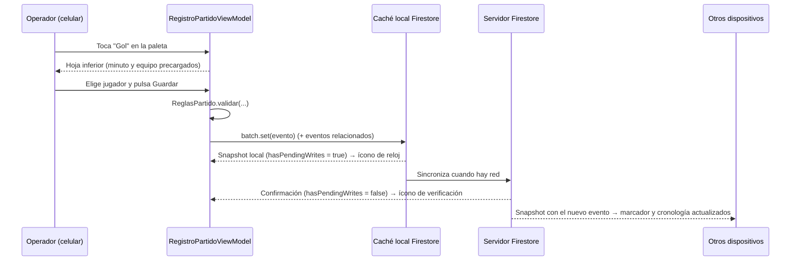

# Diseño técnico: registro de eventos del partido en tiempo real

Módulo **Partido** de SportPro. Este documento describe cómo se registran los eventos de un partido desde el celular mientras se juega, cómo llegan en tiempo real a los demás dispositivos y cómo se conserva la información si falla la conexión o si los datos están incompletos.

## 1. Objetivos

| Objetivo | Cómo se resuelve |
|---|---|
| Registrar eventos en máximo tres toques | Paleta dinámica desde el catálogo + hoja inferior con minuto y equipo precargados |
| Marcador y cronología en vivo en todos los dispositivos | Listeners de Cloud Firestore (`addSnapshotListener`) sobre el partido y sus eventos |
| Corregir sin perder trazabilidad | Versionado de eventos: nunca se sobrescribe ni se borra un documento |
| Funcionar sin conexión en la cancha | Persistencia local de Firestore + escrituras sin `await()` |
| No detener el registro por falta de datos | Opciones *Jugador no identificado* / *Jugador del rival* y etiqueta *Incompleto* |

## 2. Arquitectura

```
ui/partido        Compose + ViewModel (MVVM, StateFlow)
   │                PartidoScreen ─ NavHost interno (lista ↔ registro)
   │                RegistroPartidoScreen, EventoBottomSheet, DialogosPartido
   ▼
domain/partido    Modelos, CatalogoBase, ReglasPartido (funciones puras), PartidoRepository
   ▲
data/partido      FirestorePartidoRepository, PartidoEnCursoStore
core/red          ConectividadObserver (ConnectivityManager → Flow<Boolean>)
di                PartidoModule (Hilt: PartidoRepository → FirestorePartidoRepository)
```

- **ReglasPartido** no depende de Android ni de Firebase: calcula marcador, jugadores en cancha, suplentes disponibles, incompletos, duplicados, minuto del cronómetro y validaciones. Así el mismo cálculo sirve para la vista del espectador, las estadísticas y el insumo del resumen con IA.
- **RegistroPartidoViewModel** combina seis flujos (partido, eventos, convocados, catálogo, rol, conectividad) y un ticker de 1 s para el cronómetro, y expone un único `StateFlow<RegistroUiState>`.

## 3. Modelo de datos en Firestore

```
partidos/{partidoId}
   nombreEquipo, nombreRival, categoria, fecha
   estado: PROGRAMADO | EN_CURSO | FINALIZADO | ACTA_CERRADA
   alineacionConfirmada, cambiosPermitidos, duracionTiempoMin
   inicioPrimerTiempo, inicioSegundoTiempo  (serverTimestamp)
   enDescanso, finPrimerTiempoMinuto, finPartidoMinuto
   operadorUid, entrenadorUid, creadoPor
   actaCerradaPor, actaCerradaEn, actaCerradaConIncompletos

partidos/{partidoId}/convocados/{jugadorId}
   nombre, dorsal, titular, posicion

partidos/{partidoId}/eventos/{eventoId}          ← una versión por documento
   grupoId, version                              (todas las versiones de un evento comparten grupoId)
   tipo, tipoNombre, versionCatalogo
   minuto, equipo (PROPIO | RIVAL)
   jugadorId, jugadorNombre                      (o RIVAL / NO_IDENTIFICADO)
   jugadorSecundarioId, jugadorSecundarioNombre  (asistencia o jugador que entra)
   resultadoPenal, observacion
   operadorUid, operadorNombre, registradoEn (serverTimestamp)
   estado: VIGENTE | REEMPLAZADO | ANULADO
   incompleto, fueraDeOrden, excedeCambios, eventoOrigenId
   motivo, camposModificados, versionAnteriorId                   (correcciones)
   reemplazadoPor, reemplazadoPorUid, reemplazadoEn               (versión anterior)
   motivoAnulacion, anuladoPor, anuladoPorNombre, anuladoEn       (anulación)

catalogoEventos/{tipoId}
   nombre, ambito (PARTIDO | EQUIPO | JUGADOR), camposObligatorios[], sumaMarcador, orden, activo, version
```

El marcador **no se guarda**: se calcula a partir de los eventos vigentes cuyo tipo tiene `sumaMarcador = true`. Así, anular o corregir un gol recalcula el marcador automáticamente en todos los dispositivos, sin escrituras adicionales que puedan quedar desincronizadas.

## 4. Flujo de registro en tiempo real



- Las escrituras usan `WriteBatch.commit()` **sin `await()`**: sin conexión la tarea no se completa hasta recuperar la red, pero el evento ya está en la caché local y aparece de inmediato en la cronología.
- Los listeners usan `MetadataChanges.INCLUDE` para detectar el paso de *pendiente* a *confirmado* de cada evento.
- Eventos derivados en el mismo lote, enlazados con `eventoOrigenId`:
  - **Penal convertido** genera el evento *Gol*.
  - **Segunda amarilla** al mismo jugador genera *Tarjeta roja por doble amonestación*.
  - Al anular el evento origen se anulan también sus derivados.

### Cronómetro

El inicio de cada tiempo se guarda con `FieldValue.serverTimestamp()` y se lee con `ServerTimestampBehavior.ESTIMATE`. El minuto se calcula como `(ahora − inicio del periodo) / 60 s` (más la duración del primer tiempo en el segundo). No depende de un contador en memoria, así que sigue siendo correcto si la app pasa a segundo plano, se cierra o el teléfono se reinicia.

- **1.er tiempo:** corre hasta la duración configurada (45' por defecto) y luego cuenta tiempo añadido, como máximo 15 minutos ("45:00 +3'").
- **Descanso:** el reloj queda detenido.
- **2.º tiempo:** corre hasta 2 × duración (90'). Al cumplirse, el dispositivo del operador registra automáticamente *Fin de partido*. Solo lo hace un dispositivo, para evitar duplicados.

### Reglas del registro

| Regla | Comportamiento |
|---|---|
| Inicio sin alineación confirmada | Bloqueado: "Debes confirmar la alineación antes de iniciar el partido" |
| Minuto fuera de 0–130 | "Minuto inválido" |
| Selector de jugador | Primero los titulares en cancha, luego los suplentes, además de *Jugador del rival* y *Jugador no identificado* |
| Cambio | El que sale debe estar en cancha y el que entra debe ser un suplente no utilizado. La lista en cancha se recalcula con los eventos |
| Exceso de cambios | Advertencia "Superaste el número de cambios permitidos"; si se confirma, el evento queda con `excedeCambios = true` |
| Tarjeta roja | Retira al jugador de la lista en cancha |
| Botones de la paleta | Alto mínimo de 56 dp (por encima del mínimo de 48 dp) |

## 5. Corrección y anulación con trazabilidad

- **Editar** crea un documento nuevo (`version + 1`, mismo `grupoId`) con motivo (5–200 caracteres) y `camposModificados`. En el mismo lote, la versión anterior pasa a `REEMPLAZADO` con quién y cuándo.
- **Anular** cambia el estado a `ANULADO` con motivo obligatorio. El evento sigue visible en la cronología, tachado, y se excluye del marcador, las estadísticas y el resumen con IA.
- **Ver historial** lista todas las versiones del `grupoId` con usuario, fecha y hora, campos modificados y motivo.
- **Permisos:** solo pueden corregir el operador asignado, el entrenador responsable, el creador del partido y el administrador. Se valida en la app y en las reglas de seguridad.
- **Borrado:** no existe en la app, y en `firestore.rules` la subcolección `eventos` tiene `allow delete: if false`. Además, la regla de `update` solo permite cambiar el estado y los campos de trazabilidad: el contenido original no se puede sobrescribir.

## 6. Datos incompletos

- Todo evento de jugador puede guardarse con *Jugador no identificado*. Queda con `incompleto = true`, cuenta para el equipo pero no para un jugador.
- Un contador permanente muestra los eventos incompletos junto a la acción **Completar pendientes**, que asigna el jugador faltante creando una nueva versión del evento.
- **Registro fuera de orden:** si el minuto es menor al del último evento, se avisa, se guarda con `fueraDeOrden = true` y la cronología se ordena por minuto (con la hora real de registro como desempate).
- **Inicio del segundo tiempo sin fin del primero:** aparece "Falta registrar el fin del primer tiempo" y se ofrece insertarlo con el minuto estimado.
- **Cierre del acta con incompletos:** requiere confirmar "Se cerrará el acta con X eventos incompletos". La cantidad queda registrada en `actaCerradaConIncompletos`.
- Los campos opcionales vacíos quedan en `null` y se muestran como "Sin información".

## 7. Operación sin conexión y resincronización

| Situación | Comportamiento |
|---|---|
| Sin red | Franja fija "Sin conexión. X eventos pendientes de sincronizar" (vía `ConnectivityObserver`) |
| Evento guardado offline | Aparece al instante con ícono de reloj; pasa a verificación cuando el servidor confirma |
| Vuelve la red | Firestore sincroniza solo; la app muestra "Sincronización completa. X eventos enviados" |
| Orden de la cronología | El minuto viene del cronómetro del partido, no de la hora de sincronización |
| Dos operadores offline | Se conservan todos los eventos. Los de igual tipo, minuto, equipo y jugador se marcan como **posibles duplicados** para que el entrenador anule el que corresponda |
| App cerrada o teléfono apagado | `PartidoEnCursoStore` recuerda el partido en curso y lo reabre. Cronómetro, marcador y eventos pendientes se restauran desde la caché persistente de Firestore |

La persistencia se habilita en `di/FirebaseModule.kt` con `persistentCacheSettings {}`.

## 8. Seguridad

Las reglas están en `firestore.rules` y se publican en Firebase Console → Firestore Database → Reglas.

- Leer exige estar autenticado.
- Para crear eventos hay que ser el operador, el entrenador, el creador del partido o un administrador. Además, `operadorUid` debe ser el usuario autenticado, el estado inicial debe ser `VIGENTE` y el minuto debe estar entre 0 y 130.
- Con el acta cerrada se bloquea cualquier escritura del partido.
- El catálogo de eventos solo lo modifica el administrador.

## 9. Matriz de pruebas de casos sucios

| # | Escenario | Resultado esperado |
|---|---|---|
| 1 | Iniciar un partido sin alineación confirmada | Mensaje de bloqueo; el estado no cambia |
| 2 | Falta con *Jugador no identificado* | Evento *Incompleto*; el contador sube en 1 |
| 3 | Completar ese pendiente asignando un jugador | Nueva versión sin la etiqueta; el contador baja |
| 4 | Registrar el minuto 30 después de un evento en el 40 | Aviso "Registro fuera de orden"; queda ordenado por minuto |
| 5 | Minuto 140 | "Minuto inválido"; no se guarda |
| 6 | Inicio del 2.º tiempo sin fin del 1.º | Diálogo y opción de insertar con minuto estimado |
| 7 | Cambio con un jugador que no está en cancha | "El jugador que sale no está en cancha" |
| 8 | Cambio número 6 con 5 permitidos | Advertencia; si se confirma, etiqueta *Excede cambios* |
| 9 | Segunda amarilla al mismo jugador | Roja automática y salida de la cancha |
| 10 | Penal convertido | Penal + gol; el marcador sube |
| 11 | Anular un gol | Tachado *Anulado*; el marcador baja en todos los dispositivos |
| 12 | Editar el minuto de un gol con motivo | Versión 2 vigente, versión 1 *Reemplazado*, historial completo |
| 13 | Modo avión, registrar 3 eventos | Franja "Sin conexión. 3 eventos pendientes…" e íconos de reloj |
| 14 | Quitar el modo avión | "Sincronización completa. 3 eventos enviados" e íconos de verificación |
| 15 | Dos celulares offline registran el mismo gol | Alerta de posibles duplicados; se anula uno |
| 16 | Cerrar la app durante el partido y reabrir | Se abre el partido en curso con el cronómetro correcto |
| 17 | Cerrar el acta con 2 incompletos | Confirmación explícita y cantidad registrada |
| 18 | Intentar borrar un evento desde la consola o un cliente | Rechazado por las reglas (`allow delete: if false`) |

Cada escenario debe documentarse con captura o video como evidencia. Los escenarios 13 y 14 se graban durante el partido de práctica.

## 10. Integración con los demás módulos

- **Catálogo de eventos:** la paleta se construye desde `catalogoEventos`. Si la colección está vacía, la app publica el catálogo base, que el administrador puede editar luego.
- **Convocatoria y alineación:** se leen de `partidos/{id}/convocados` (campo `titular`) y de `alineacionConfirmada`. Mientras ese módulo se integra, la lista de partidos permite crear un **partido de práctica** con un plantel de ejemplo.
- **Seguimiento en vivo, estadísticas y resumen con IA:** deben usar solo los eventos con `estado = VIGENTE` y pueden reutilizar `ReglasPartido` para el marcador y los cálculos.
